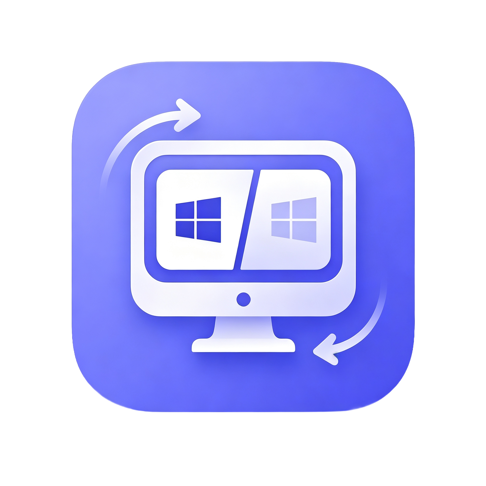
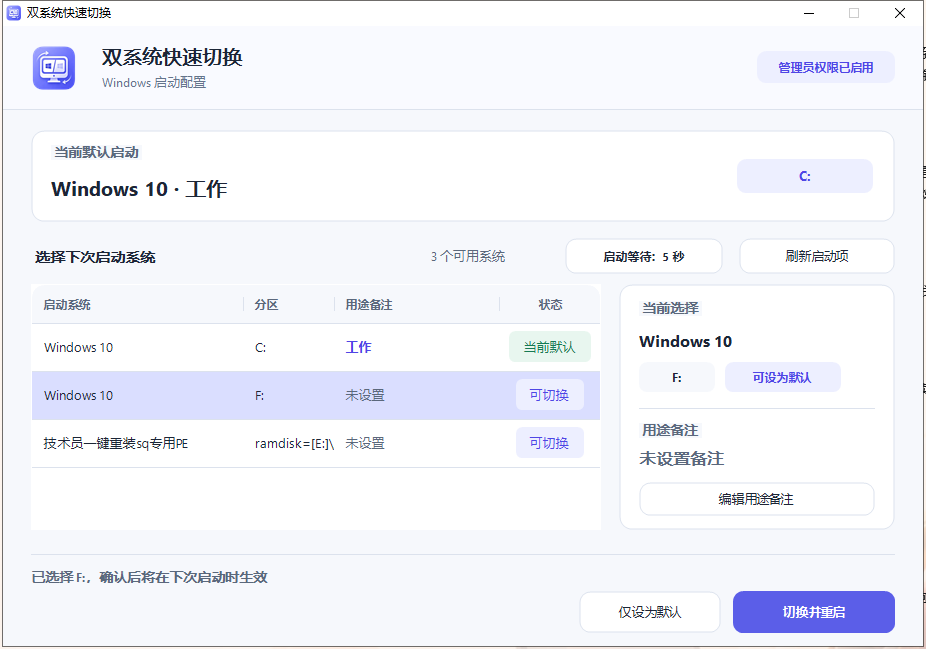

<p align="center">
  
</p>

<h1 align="center">双系统快速切换</h1>

<p align="center">一个可直接复制运行的现代 Windows 小工具，用于在多个 Windows 引导项之间快速切换。</p>

<p align="center">
  
  
  
</p>

## 下载

打开 GitHub 仓库的 **Releases** 页面，下载 `DualBootSwitcher.exe`（单文件版）或 `DualBootSwitcher-portable.zip`（附带 README 和许可证）。无需安装额外组件；首次运行仍会按 Windows 的 UAC 规则申请管理员权限。

## 界面预览

<p align="center">
  
</p>

<p align="center"><sub>选择目标系统后，可以仅修改默认启动项，也可以确认后立即切换并重启。</sub></p>

## 便携运行

- 适用于 Windows 10 和 Windows 11，使用系统自带的 .NET Framework 4.x；不需要安装 SDK、运行库、DLL 或其他附件。
- 启动后会在后台检查 GitHub 最新正式版；发现更新时可在软件内下载、校验并自动替换重启。
- 云更新只下载官方 Release 中的 `DualBootSwitcher.exe`，并使用 GitHub 提供的 SHA-256 摘要验证文件完整性。
- 软件启动时会通过 GitHub Contents API 自动读取并显示官方 `ANNOUNCEMENT.md`，不依赖仓库分支名称；发布者更新该文件后，用户无需下载新版 EXE 即可查看新内容。公告支持 Markdown 的大标题、小标题、正文、列表、分隔线、HTTPS 图片和 HTTPS 链接；窗口内始终提供可点击的项目主页链接。
- 本地 Windows 系统切换通过 Windows BCD 默认项完成。
- 直接下载并双击 `release\DualBootSwitcher.exe` 即可运行；`release\DualBootSwitcher-portable.zip` 仅用于方便分发和附带说明文件。
- Logo 和程序图标已嵌入 exe；标题区直接使用内嵌高清 PNG 绘制，不会放大低分辨率 ICO，也不依赖旁边的资源文件。
- AntdUI 2.4.4、Logo、许可证和全部运行代码均嵌入 exe，运行时不需要旁边放置 DLL 或其他资源。
- 表格选择、按钮悬停/按压/加载、输入焦点和状态文字采用短缓动，并自动跟随 Windows 的界面动画设置。
- 当前便携版未使用商业代码签名证书；从网络下载后若 Windows SmartScreen 提示，请先确认文件来源再选择运行。

## 管理员权限

- 程序清单使用 `requireAdministrator`：当前进程未提权时，Windows 会在启动时自动显示 UAC；如果已经拥有提升后的管理员令牌，则直接进入软件，不会重复申请。
- 程序还包含 `runas` 代码兜底，用于清单未被宿主正确应用的情况。用户取消 UAC 后，软件不会修改任何引导设置。

## 使用方法

1. 双击 `release\DualBootSwitcher.exe`。
2. 在 Windows 的管理员权限提示中点击“是”。
3. 选择要进入的系统。
4. 点击“切换并重启”，确认后电脑会立即重启到所选系统。

也可以点击“仅设为默认”，稍后自行重启。

点击“公告”可再次自动读取官方维护提醒、兼容性说明和使用通知；网络暂时不可用时不会影响本地系统切换，下次打开公告会自动重试。

在启动菜单中选中系统后，点击“编辑备注”或双击该行，可以保存“工作”“游戏”“测试”等用途说明。备注只保存在当前 Windows 用户的设置中，不会改动 BCD；换电脑后需要重新设置备注。

选中系统后，右侧详情区会同时显示系统名称、分区、当前状态和用途备注；切换按钮只在目标不是当前默认系统时可用。

“启动等待”按钮显示开机选择系统的当前超时时间。点击后可以设置 `0` 到 `999` 秒，点击“保存修改”后立即生效。设置为 `0` 秒会直接进入默认系统，不再等待选择。

## 安全边界

- 程序只读取 Windows BCD 引导配置，并调用 `bcdedit /default` 设置默认启动项、调用 `bcdedit /timeout` 设置启动菜单等待时间。
- 启动项备注保存在当前用户注册表 `HKCU\Software\DualBootSwitcher\BootRemarks`，与 BCD 修改完全分开。
- 不会删除、重命名或创建任何引导项。
- 只显示 Windows 启动菜单中实际可选的系统；隐藏的恢复或遗留加载器不会被显示或设为默认项。
- “切换并重启”会先显示确认提示；确认前不会修改引导配置。
- 该程序必须以管理员权限运行，Windows 会在启动时自动请求权限。
- 当前版本已验证中文和英文 Windows 的 `bcdedit` 输出；其他系统显示语言会显示明确的兼容性提示，而不会修改引导项。

## 重新构建

在 Windows PowerShell 中运行：

```powershell
.\build.ps1
.\run-tests.ps1
```

构建产物会生成在 `release\DualBootSwitcher.exe`，便携分发包会生成在 `release\DualBootSwitcher-portable.zip`。GitHub Actions 会在推送 `v*` 标签时自动构建并创建 Release。

首次构建会从 NuGet 下载固定版本的 AntdUI，并校验 SHA-256。该 DLL 只用于编译并会嵌入 exe，最终发布目录不会包含外部 DLL。

## UI 与动画

- 使用 AntdUI 提供统一的 GDI+ 按钮、面板、表格、输入控件和模态提示。
- 主界面采用任务导向的单页工作区：顶部为启动状态条，桌面宽度下使用约 64:36 的系统列表与目标详情分栏，窄窗口自动上下堆叠。
- 启动状态条展示当前默认系统和下次启动目标；公告摘要和“查看公告”按钮位于次级区域，启动等待时间位于系统列表工具栏，版本与云更新状态位于项目动态区域。
- 系统列表使用中性未选中行、浅绿色圆角选中态、左侧绿色状态标记、备注 Pill 和状态圆点；双击备注可以就地编辑，Enter 保存、Esc 撤销。
- Windows 11 使用 DWM 系统背景材质与圆角，Windows 10 使用浅色高对比材质回退；所有运行资源仍嵌入单文件 EXE。

## 图标来源

应用 Logo 使用用户提供的 `assets\dual-boot-switcher-logo.png`，构建时会裁掉透明外边距并嵌入多尺寸 ICO。运行时不读取该 PNG。

## UI 配色来源

界面使用已批准的浅色绿色令牌：主色 `#168C68`、悬停色 `#0F6F52`、工作区 `#EEF1F4`、辅助层 `#F7F9FA`、面板 `#FFFFFF`、正文 `#17202A` 和边界 `#DBE4E7`。动效只用于选择、状态和按压反馈，遵循 Windows 减少动画设置。

## 第三方组件

现代控件由 [AntdUI](https://gitee.com/AntdUI/AntdUI) 提供，版本 `2.4.4`。主界面视觉与交互参考并改造自 [OrbiEn Desktop](https://github.com/orbien-org/orbien)。两者均采用 Apache License 2.0，完整许可证和第三方声明已嵌入 exe，并包含在便携 ZIP 中。
